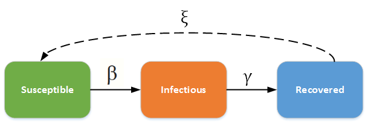
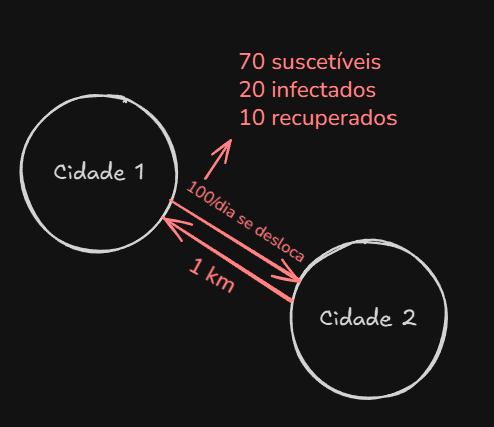

# PI-GRAPHS
Simulação de epidemia representada por grafos, baseada no modelo SIRS (suscetível-infectado-removido-suscetível).

---

## 🧬 Modelo epidemiológico SIRS com dinâmica vital
O modelo **SIRS** (suscetível-infectado-removido-suscetível) descreve a propagação de doenças infecciosas em uma população, tendo imunidade temporária após infecção, como no caso da influenza. <br/>
Dinâmica vital representa a natalidade e mortalidade natural em uma população.


### Modelo SIRS
- **S**: número de indivíduos suscetíveis.
- **I**: número de indivíduos infectados.
- **R**: número de indivíduos removidos (ou recuperados).
- **N**: população total (S + I + R).
- **β (beta)**: taxa de infecção.  
- **γ (gama)**: taxa de recuperação.  
- **ξ (xi)**: taxa de perda de imunidade.  
- **μ (mu)**: taxa de mortalidade.  
- **ν (nu)**: taxa de natalidade.  
As equações diferenciais que regem o modelo são:

$$
\begin{aligned}
\frac{dS}{dt} &= \nu N - \beta \frac{S I}{N} + \xi R - \mu S \\
\frac{dI}{dt} &= \beta \frac{S I}{N} - \gamma I - \mu I \\
\frac{dR}{dt} &= \gamma I - \xi R - \mu R
\end{aligned}
$$

#### Versão discreta das equações diferenciais
Na forma discreta, as equações são atualizadas a cada passo de tempo \( $\Delta t$ \), representando a evolução das populações **S**, **I** e **R** ao longo do tempo.

$$
\begin{aligned}
S_{t+\Delta t} &= S_t + \Delta t \left( \nu N_t - \beta \frac{S_t I_t}{N_t} + \xi R_t - \mu S_t \right) \\
I_{t+\Delta t} &= I_t + \Delta t \left( \beta \frac{S_t I_t}{N_t} - \gamma I_t - \mu I_t \right) \\
R_{t+\Delta t} &= R_t + \Delta t \left( \gamma I_t - \xi R_t - \mu R_t \right) \\
\end{aligned}
$$

Quanto menor $\Delta t$, (por exemplo, 0.01 dias), mais precisa em relação a sua forma contínua.

---

## Modelagem do Grafo
Cada cidade é representada como um vértice contendo seu próprio sistema SIRS. As cidades estão conectadas por arestas bidirecionais, que representam fluxos de pessoas entre elas. Cada aresta possui um peso, indicando a distância entre as cidades.
<details>
    <summary><b>Diagramas rascunhos</b></summary>
    
    
</details>

---

## ⚙ Tecnologias utilizadas
- **Javascript (TypeScript)**: linguagem principal.
- **Cytoscape.js**: visualização de grafos.
- **Vite**: ferramenta de build e desenvolvimento rápido.

---

## 🛠 Instalação
### Pré-requisitos
- [Node.js](https://nodejs.org/en/download)
### Etapas
1. **Clone o repositório**
   ```bash
   git clone https://github.com/dsousr/PI-Graphs.git
   cd PI-GRAPHS/epidemic-simulation
   ```
2. **Instale as depedências** <br>
    ```bash
    npm install
    ```
3. **Execute a aplicação**
   ```bash
   npm run dev
   ```
